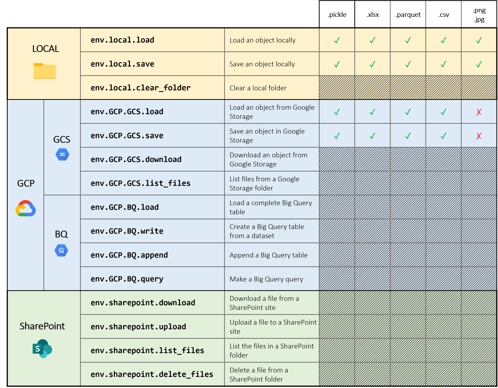

# Easy environment

Easy Environment is a Python tool that provides **easy-to-use functionality for managing files and data in different environments**. It offers a class called Environment that simplifies file operations on local disk and Google Cloud Platform (GCP) services such as Google Cloud Storage (GCS) and BigQuery (BQ).

## Features

* Load and save files in various formats such as PNG, JPG, XLSX, Parquet, CSV, and Pickle.
* Support for loading and saving files from local disk and GCS.
* Seamlessly interact with GCP services including GCS and BQ.
* Flexible configuration for file loaders and savers.

<p align="center">
  
</p>

## Initialize the Environment

To start using Easy Environment, create an instance of the `Environment` class, providing the necessary parameters:

```python
from environment import Environment

env = Environment(
  local_path='path/to/project/root',
  GCP_project_id='your-project-id', # Optional
  GCP_credential_path="path/to/credentials.json", # Optional
  GCS_path='gs://your-bucket-name/' # Optional
                  )
```

## Local File Operations

Easy Environment provides a `Disk` class for local file operations. You can access it through the `local` attribute of the `Environment` instance.

```python
# Load/Save a pickle object
my_dictionnary = env.local.load('inputs/my_dictionnary.pickle')
env.local.save(my_dictionnary, 'outputs/my_dictionnary.pickle')

# Load/Save an image (png / jpg)
my_logo = env.local.load('inputs/my_logo.png')
env.local.save(my_logo, 'outputs/my_logo.png')

# Load/Save a dataset (csv / excel / jpg)
dataset = env.local.load('inputs/dataset.csv')
env.local.save(dataset, 'outputs/dataset.csv')
```

## GCS Operations

To perform file operations on Google Cloud Storage, use the `GCS` class accessible through the `GCP` attribute of the Environment instance.

```python
# Load a pickle object
env.GCP.GCS.load(my_dictionnary, 'my_dictionnary.pickle')

# Save a parquet dataset
env.GCP.GCS.save(dataset, 'dataset.parquet')
```

## Big Query Operations

For working with BigQuery, use the `BQ` class accessible through the `GCP` attribute of the `Environment` instance.

```python
# Create a table
env.GCP.BQ.write(dataset, 'mydata.mytable')

# Append a table
env.GCP.BQ.append(dataset, 'mydata.mytable')

# Make a query
query = """
SELECT 
  *
FROM 
  mydata.mytable
WHERE 
  Age > 50
"""

new_dataset = env.GCP.BQ.query(query).to_dataframe()
```

## Customizing File Loaders and Savers

Easy Environment allows you to customize the file loaders and savers by providing configuration dictionaries during initialization. Here's an example:

```python
loader_config = {
    'txt':      txt_loader_function,
    'json':     json_loader_function,
    # Add more file extensions and corresponding loader functions
}

saver_config = {
    'txt':      {'func': 'txt_saver_function', 'args': {}},
    'json':     {'func': 'json_saver_function', 'args': {}},
    # Add more file extensions and corresponding saver functions and arguments
}

env = Environment(
    local_path='path/to/project/root',
    GCP_project_id='your-project-id',
    GCP_credential_path="path/to/credentials.json",
    GCS_path='gs://your-bucket-name/',
    loader_config=loader_config,
    saver_config=saver_config
)
```

In the above example, you can specify custom loader and saver functions for file extensions not covered by the default configurations. Just replace 'txt_loader_function' and 'txt_saver_function' with your own loader and saver functions, respectively.

Make sure to import the necessary functions and libraries for your custom loaders and savers.

## Future Improvements

Future releases of Easy Environment will include support for additional cloud storage providers, including Amazon Web Services (AWS) and Microsoft Azure, in addition to the existing Google Cloud Storage (GCS) functionality. This expansion aims to provide users with increased flexibility when working with cloud-based environments.